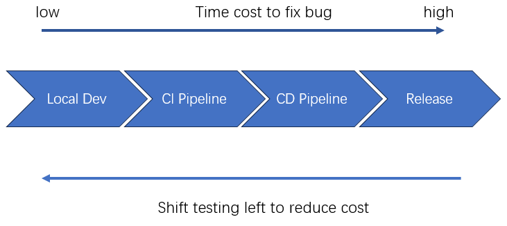
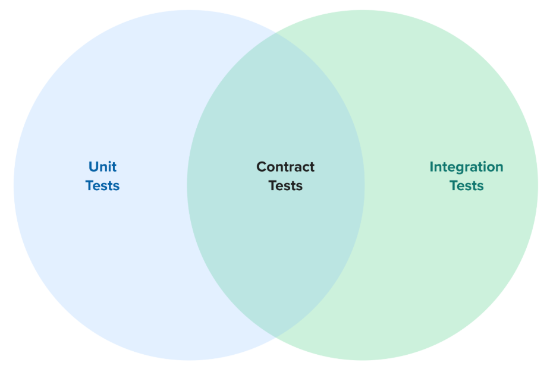

# Shift Left with Contract Testing

## What is "Shift Left"?
"Shift Left" is a software development approach that emphasizes the importance of testing and quality assurance early in the development lifecycle. By moving testing activities to the left side of the project timeline, teams can identify and address issues sooner, leading to improved software quality, reduced costs, and faster delivery times.

## What is Contract Testing?
Contract testing is a testing approach that focuses on verifying the interactions between different services or components in a system. It ensures that the communication between these services adheres to predefined contracts, which specify the expected behavior, data formats, and protocols. Contract testing helps to identify integration issues early and ensures that services can evolve independently without breaking existing functionality.

## Benefits of Contract Testing

Use contract testing when applicable to improve test stability, efficiency & coverage and reduce cost.

